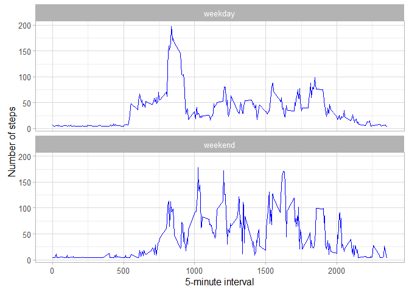

# Reproducible Research: Peer Assessment 1

								
## Loading and preprocessing the data					
								

```r
data<-read.csv("activity/activity.csv")					
View(data)							
```
								
## What is mean total number of steps taken per day?				
								

```r
steps_per_day<-aggregate(steps ~ date, data, sum)				
head(steps_per_day)							
```

```
##         date steps
## 1 2012-10-02   126
## 2 2012-10-03 11352
## 3 2012-10-04 12116
## 4 2012-10-05 13294
## 5 2012-10-06 15420
## 6 2012-10-07 11015
```

```r
View(steps_per_day)							
								
hist(steps_per_day$steps, main = "Total Steps per Day", col="orange", xlab = "No. of Steps")
```


```r
rmean<-mean(steps_per_day$steps)					
rmedian<-median(steps_per_day$steps)					
```
The mean is							

```
## [1] 10766.19
```
and the median is.R							

```
## [1] 10765
```
								
## What is the average daily activity pattern?				

```r
dailyactivitypattern<-aggregate(steps ~ interval, data, mean)			
head(dailyactivitypattern)						
```

```
##   interval     steps
## 1        0 1.7169811
## 2        5 0.3396226
## 3       10 0.1320755
## 4       15 0.1509434
## 5       20 0.0754717
## 6       25 2.0943396
```

```r
View(dailyactivitypattern)						
								
##Make a time series plot (i.e. type = "l") of the 5-minute interval (x-axis) and the average number of steps taken, averaged across all days (y-axis)
								
plot(dailyactivitypattern, type="l", col="red", xlab="interval", ylab="steps",main = "Daily Activity pattern")
```


```r
##Which 5-minute interval, on average across all the days in the dataset, contains the maximum number of steps?
								
max_interval<-dailyactivitypattern[which.max(dailyactivitypattern$steps), 1]		
```
## Imputing missing values						
								

```r
##Calculate and report the total number of missing values in the dataset (i.e. the total number of rows with NAs)
								
narows<- is.na(data)							
```
Total number of missing values						

```
## [1] 2304
```

```r
##Devise a strategy for filling in all of the missing values in the dataset. The strategy does not need to be sophisticated. For example, you could use the mean/median for that day, or the mean for that 5-minute interval, etc.
library(acepack)
```

```
## Warning: package 'acepack' was built under R version 3.2.3
```

```r
library(Hmisc)							
```

```
## Warning: package 'Hmisc' was built under R version 3.2.3
```

```
## Loading required package: lattice
```

```
## Loading required package: survival
```

```
## Loading required package: Formula
```

```
## Warning: package 'Formula' was built under R version 3.2.3
```

```
## Loading required package: ggplot2
```

```
## Warning: package 'ggplot2' was built under R version 3.2.3
```

```
## 
## Attaching package: 'Hmisc'
```

```
## The following objects are masked from 'package:base':
## 
##     format.pval, round.POSIXt, trunc.POSIXt, units
```

```r
data$steps<-impute(data$steps, fun=mean)				
View(data$steps)							
```

```r
##Create a new dataset that is equal to the original dataset but with the missing data filled in.
								
Newdata <-data							
View(Newdata)							
```

```r
##Make a histogram of the total number of steps taken each day and Calculate and report the mean and median total number of steps taken per day. Do these values differ from the estimates from the first part of the assignment? What is the impact of imputing missing data on the estimates of the total daily number of steps?
								
Newsteps_per_day<-aggregate(steps ~ date, Newdata, sum)			
hist(Newsteps_per_day$steps, main = "Total Steps per Day", col="orange", xlab = "No. of Steps")
```


```r
rmeansteps<-mean(Newsteps_per_day$steps)				
rmediansteps<-median(Newsteps_per_day$steps)				
```
The mean is							

```
## [1] 10766.19
```
and the median is.R							

```
## [1] 10766.19
```
								
								
## Are there differences in activity patterns between weekdays and weekends?	
								

```r
##Create a new factor variable in the dataset with two levels - "weekday" and "weekend" indicating whether a given date is a weekday or weekend day.
								
Newdata$WeekDay <- ifelse(weekdays(as.Date(Newdata$date))==c("Sunday"), "weekend", "weekday")
View(Newdata)							
```
								

```r
##Make a panel plot containing a time series plot (i.e. type = "l") of the 5-minute interval (x-axis) and the average number of steps taken, averaged across all weekday days or weekend days (y-axis). 
								
weekdayActivity <- aggregate(steps ~ WeekDay+interval, Newdata, mean)		
								
ggplot(weekdayActivity, aes(interval, steps)) + 				
    geom_line(color="blue") + 						
    facet_wrap(~ WeekDay,nrow=2,ncol=1) +				
    xlab("5-minute interval") + 						
    ylab("Number of steps")+theme_light()					
```


